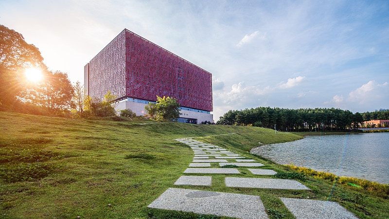

---
hide:
  - navigation 
  - toc        
---

    
        
            
        
        
            <text>我们从事了什么的研究 </text>
        
     
	
        
            
        
        
            <text>我们从事了什么的研究 </text>
        
     
	
        
            
        
        
            <text>我们从事了什么的研究 </text>
        
     

<!-- 

		

			<ul>
				<li></li>
				<li></li>
				<li></li>
			</ul>
		

 -->

# 

<!-- <link rel="stylesheet" href="stylesheets/index.css">
 -->